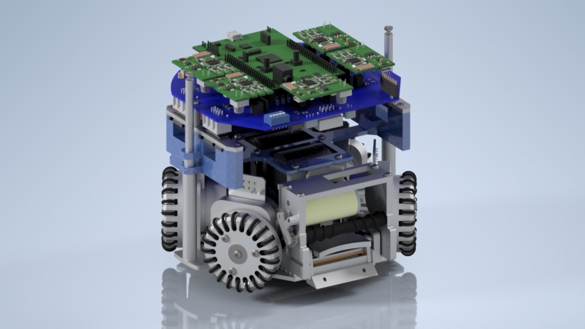
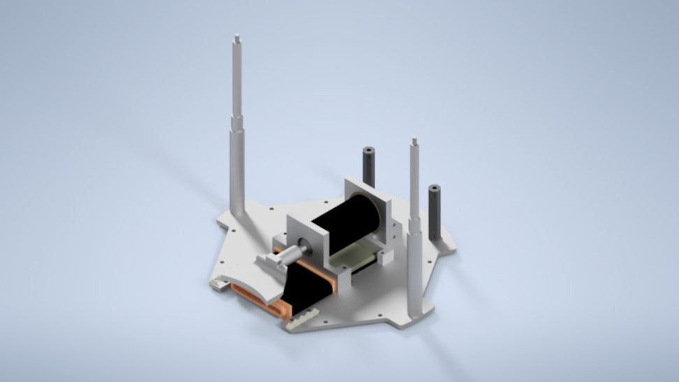
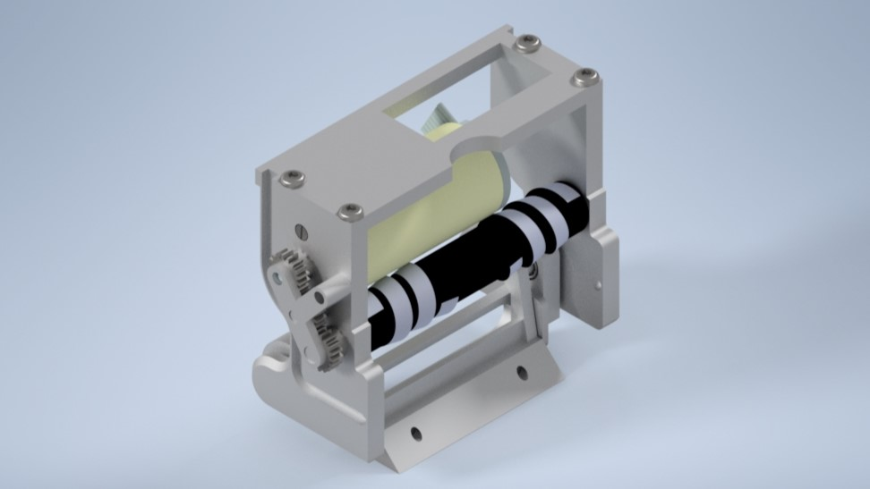
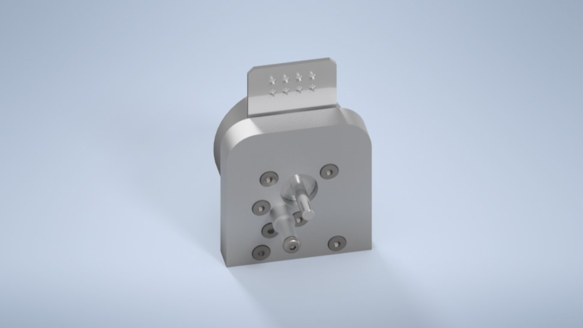
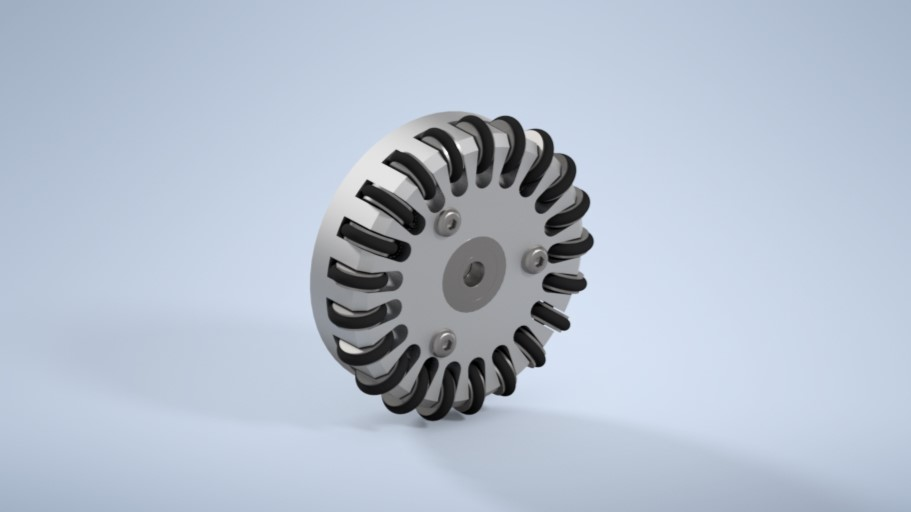
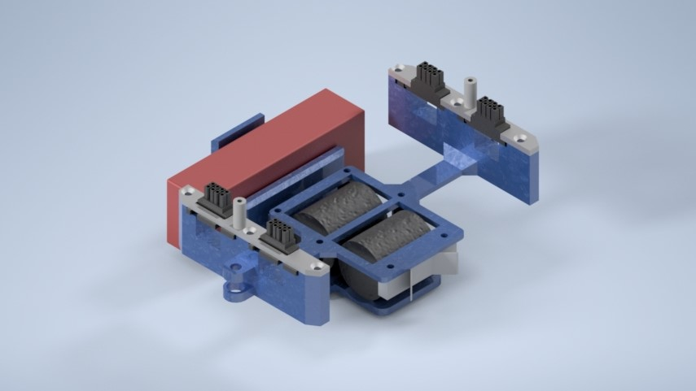
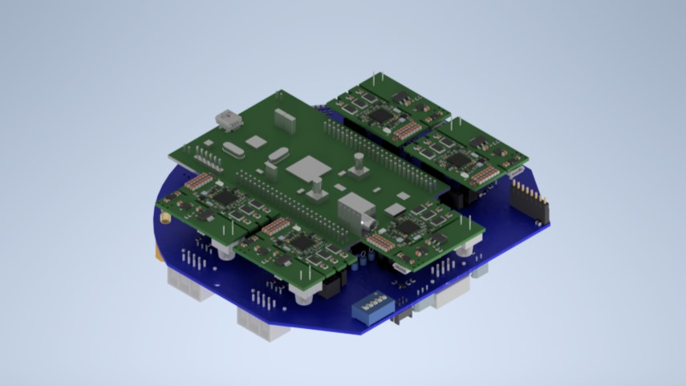

# Mechanics - RoboFEI SSL

## Robot Specifications

| Robot version       | v2014         | v2023         |
| -----------------   | --------------| --------------|
| Dimension           | Ø179 x 150mm  | Ø179 x 150mm  |
| Total weight        | 3,5 kg        |  2,5 kg       |
| Driving motors      | Maxon,EC-flat-45 50W 18V | Maxon,EC-flat-45 50W 18V |
| Gear                | 3:1 | 3:1 |
| Gear type           | Internal Spum|  Internal Spum| 
| Wheel diameter      | 54mm | 54mm |
| Encoder             | US DIGITAL E4T-1000-157-S-H-M-B | US DIGITAL E4T-1000-157-S-H-M-B |
| Dribbling motor     | Maxon EC-max-22 25W 18V| Maxon EC-max-22 25W 18V|
| Dribbling gear      | 7:3 | 1:1:1 |
| ø Dribbling bar     | 16 mm| 9.5 mm|
| Kicker charge       | 2x 2700µF @ 200V| 2x 1000µF @ 200V|
| Straight kick speed | higher than 6,5 m/s | higher than 6,5 m/s |
| Microcontroller     | Xilinx Spartan 3 FPGA | STM 32F4011|
| Sensors             | Encoders, Gyroscope, Accelerometer | Encoders, Gyroscope, Accelerometer |
| Communication link  |  nRF24L01 transceiver, 2 Mbps, 2.4/2.5 GHz| nRF24L01 transceiver, 2 Mbps, 2.4/2.5 GHz|
| Power Supply        | Li-Po  Battery, 11.1 V nominal, 2200mAh|Li-Po  Battery, 11.1 V nominal, 2200mAh|

## Naming Componets Explanation

<b>RBFXX.AYZZ-W

- RBF = RoboFEI
- XX = Year of the component
- A = Type of the componet
    -  D: Drow
    -  P: Part
    -  A: Assembly
    -  E: Eletrical Parts
- Y = Component set 
    1. Bottom
    2. Front
    3. Bracket
    4. Wheels
    5. Top
    6. Electronic Board
- ZZ = Internal componet number
- W = Componet version

## Robot Sections

### 1. Bottom Set

The Bottom Set is composed of both of the kick systems, the front kick, and the chip kick, in addition to the robot's support rods and the base. 

### 2. Front Set

The Front Set is responsible for the ball control, being divided by the roller system, the motor, and the supports.

### 3. Bracket Set

The Brackets are responsible for supporting the wheels and the wheels-motors.

### 4. Wheels Set

The Wheels are in charge of the omnidirectional robot movements.

### 5. Top Set

The Bottom Set looks after the capacitors, the battery and too supports the electric board.

### 5. Electronic Board 

This Set is for all Electronic Boards of the robot. Including the main, the motors, and the kick one.
